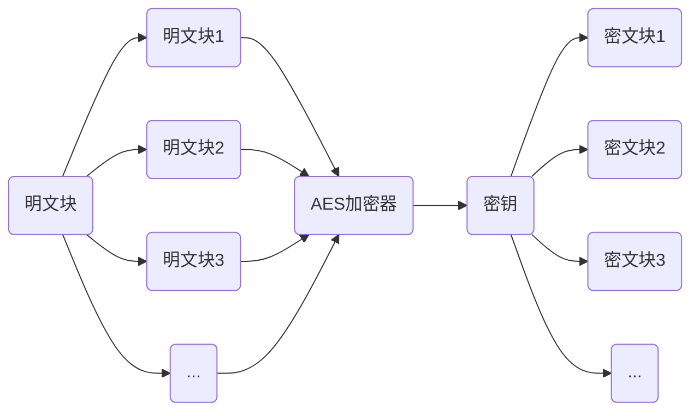

#### AES简介

- 密码学中的高级加密标准，又称为Rijndael加密法，是美国联邦政府采用的一种区块加密标准
- AES属于对称加密标准，加密解密使用同一个密钥
- 对称加密算法，一般有至少4中模式，即ECB，CBC，CFB，OFB

#### 安装openssl

```shell
#下载openssl源码并解压
https://www.openssl.org/
tar -zxvf xxx.tar.gz
##编译安装
#进入解压后的文件目录
./config shared
#出现Configure for linux-x86_64配置就成功了

make
#出现Makefile:310:recipe for target 'test_cms' failed 和 Makefile:411: recipe for target 'tests' failed，查资料说是bug，不用管

make install(需要root权限)
#出现 POD document had syntax errors at /usr/bin/pod2man line 71.Makefile:594 recipe for target 'install_docs' failed.
#解决方法
mv /usr/bin/pod2man /usr/bin/pod2man_cp

#此时就安装完成了，默认安装在/usr/local/ssl 下

##创建软连接
#先备份原来的openssl
which openssl
mv /usr/bin/openssl /usr/bin/openssl-bak	路径根据上面的命令确定
ln -s /usr/local/ssl/bin/openssl /usr/bin/openssl

#gcc使用openssl库
vi /etc/ld.so.conf
#把/usr/local/openssl/lib	添加到最后一行
ldconfig

#test.cpp 测试openssl的功能
```

#### ECB模式

- 电子密码本模式。实现逻辑如下图所示，AES算法的数据分组(明文块，密文块)长度为128比特、密钥长度为128/192/256比特。缺点是：电子编码薄模式用一个密钥加密消息的所有块，如果原消息中重复明文块，则加密消息中的相应密文块也会重复，因此，这种模式适用于加密小消息



- 函数说明

  ```c++
  //生成加密、解密的key
  int AES_set_encrypt_key(const unsigned char *userKey, const int bits,AES_KEY *key);
  int AES_set_decrypt_key(const unsigned char *userKey, const int bits,AES_KEY *key);
  /*
  	参数:
          userKey:密钥数值
          bits:密钥长度，以bit为单位
          key:AES_KEY对象指针
          返回值:
          0 成功
          -1 userkey,key为空
          -2 密钥长度不是128，192，256
  */
  ```

  ```c++
  //AES_ECB加密、解密
  void AES_ecb_encrypt(const unsigned char *in, unsigned char *out, const AES_KEY *key, const int enc);
  /*
  	参数:
  		in: 输入数据固定为16字节
  		out:输出数据，长度与输入数据一致，固定为16字节
  		key:使用AES_set_encrypt_key/AES_set_decrypt_key生成的key
  		enc:AES_ENCRYPT代表加密，AES_DECRYPT代表解密
  */
  ```

  - 编程实现
    - 由于ECB模式，每次只能处理一个块的数据，即16字节，所以如果需要处理任意长度的数据，那么需要在原始数据的末尾，进行填充，是的数据长度为16的整数倍，随后在分块加密。解密时，也需要分块解密，最后将解密的数据，进行取消填充
    - AES支持多种填充方式，如：NoPadding、PKCS5Padding、PKCS7Padding等
    - PKCS7填充方式
      - 假设数据长度需要填充n个字节才对齐，那么填充n个字节，每个字节都是n;如果数据本身就已经对齐了，则填充一块长度为块大小的数据，每个字节都是块大小
    - 代码参考test3.cpp

#### CBC模式

- CBC模式的加密首先也是将明文分成固定长度的块，然后将前面一个加密快输出的密文与下一个要加密的明文块进行异或操作，将计算结果再用密钥进行加密得到密文。第一明文块加密的时候，因为前面没有加密的密文，所以需要一个初始化向量。跟ECB方式不一样，通过连接关系，使得密文跟明文不再是一一对应的关系，破解起来更困难，而且克服了只要简单调换密文块可能达到目的的攻击

- 函数说明

  ```c++
  //AES_CBC 加密、解密
  void AES_cbc_encrypt(const unsigned char *in, unsigned char *out,size_t length, const AES_KEY *key, 
                       unsigned char *ivec, const int enc);
  
  /*
  	参数:
  		in	 	输入数据
  		out		输出数据
  		length 	输入数据的实际长度，字节数
  		key		使用AES_set_encrypt_key/AES_set_decrypt_key生成的key
  		ivec	可读写的一块内存。长度必须是16字节
  		enc		AES_ENCRYPT 代表加密、AES_DECRYPT代表解密
  */
  
  ```

  - 参考test4.cpp

#### OFB128模式

- OFB模式与CFB模式相似，唯一差别是，CFB中密文填入加密过程下一阶段，而在OFB中，初始化向量加密过程的输入填入加密过程下一阶段

- 函数说明

  ```c++
  //AES OFB128加密/解密
  void AES_ofb128_encrypt(const unsigned char *in, unsigned char *out,size_t length, const AES_KEY *key,
                          unsigned char *ivec, int *num);
  
  /*
  	参数:
  		in	 	输入数据
  		out		输出数据
  		length 	输入数据的实际长度，字节数
  		key		使用AES_set_encrypt_key生成的key
  		ivec	可读写的一块内存。长度必须是16字节
  		num 	应总是0，否则会触发断言
  		
  		in为明文就是加密，为密文就是解密
  */
  
  ```

- 参考test5.cpp

#### CFB1模式

- 面向字符的应用程序的加密要使用流加密，可以使用加密反馈模式。在此模式下，数据用更小的单元加密，可以是8位，这个长度小于定义的块长(通常是64位)

- 函数说明

  ```c++
  //AES DFB1模式加密、解密
  void AES_cfb1_encrypt(const unsigned char *in, unsigned char *out,size_t length, const AES_KEY *key,unsigned char *ivec, int *num, const int enc);
  
  /*
  	参数:
  		in	 	输入数据，长度任意
  		out		输出数据，长度和输入数据一样
  		length 	输入数据的位数，比特数，即输入数据的长度*8
  		key		使用AES_set_encrypt_key生成的key
  		ivec	可读写的一块内存。长度必须是16字节
  		num		应总是0，否则会触发断言
  		enc		AES_ENCRYPT 代表加密、AES_DECRYPT代表解密
  		
  */
  /*
  	AES_cfb1_encrypt()在加密过程中会修改ivec的内容，所以ivec不能h'se'zhi'wei
  */
  ```

  
